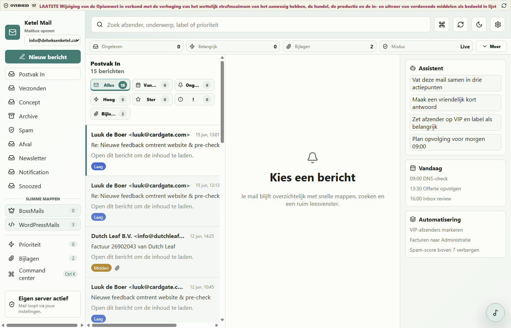
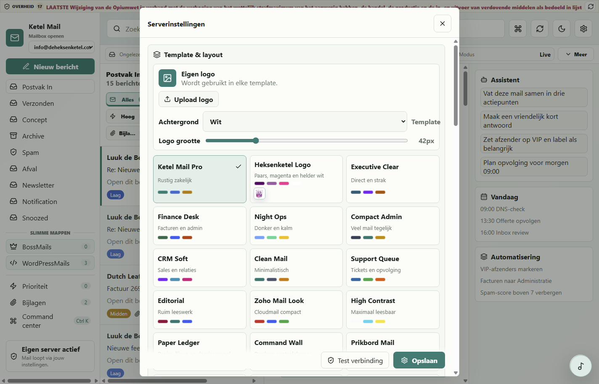

# Ketel Mail

Ketel Mail is een gratis, zelf-hostbare webmail-app voor je eigen server. De app start standaard met een demo-inbox, zodat je direct kunt kijken hoe hij werkt. Zet `DEMO_MODE=false` en vul IMAP/SMTP-gegevens in om hem met een echte mailbox te gebruiken.

## Snel starten op Debian / ParrotOS

```bash
chmod +x install-debian-parrot.sh start-debian-parrot.sh
./install-debian-parrot.sh
./start-debian-parrot.sh
```

Als Electron systeemlibs mist:

```bash
sudo apt update
sudo apt install -y nodejs npm libgtk-3-0 libnss3 libxss1 libasound2 libatk-bridge2.0-0 libdrm2 libgbm1
```

## Screenshots





## Lokaal starten

```bash
npm install
npm run dev
```

Open daarna `http://localhost:5173`.

## Magische Windows-installatie

Voor Windows zit er een visuele installatiepagina bij:

1. Pak de zip uit.
2. Open `install.html`.
3. Gooi alle stofjes/elementen in de ketel.
4. Klik op `Installeer Ketel Mail`.

De installer zet Ketel Mail in `%LOCALAPPDATA%\Ketel Mail\app`, bouwt de app, maakt een bureaublad- en startmenu-snelkoppeling en start het eigen desktopvenster. Windows laat taakbalk-vastpinnen niet betrouwbaar stilletjes toe; klik na het starten met rechts op Ketel Mail in de taakbalk en kies `Aan taakbalk vastmaken`.

## Echte Windows .exe installer

Voor collega's is de makkelijkste route het ene bestand:

```text
release/Ketel-Mail-Setup-0.1.0.exe
```

Die installeert Ketel Mail als desktop-app, maakt snelkoppelingen en start de app na installatie. De installer is bedoeld voor moderne 64-bit Windows-systemen. Echte mailboxen voeg je daarna in Ketel Mail toe via Instellingen, Mailaccounts.

## Productie draaien

```bash
npm install
npm run build
npm start
```

Open daarna `http://localhost:8080`.

## Eigen desktopvenster

Ketel Mail kan ook als losse desktop-app draaien. De app start dan zelf de lokale mailserver en opent in een eigen venster.

```bash
npm run desktop
```

Sneller opnieuw openen wanneer er al een productiebuild staat:

```bash
npm run desktop:fast
```

Installers bouwen voor verschillende OS'en:

```bash
npm run dist:win
npm run dist:linux
npm run dist:mac
```

De builds komen in `release/`. Bouw macOS-installers het liefst op macOS; Windows- en Linux-builds kunnen vanaf hun eigen OS worden gemaakt.

## Screenshots verversen

Zorg dat Ketel Mail lokaal draait op `http://127.0.0.1:8080` en run:

```bash
npm run screenshots
```

## Docker

```bash
docker compose up --build
```

## Eigen mailserver

Ketel Mail is de webmail-laag. Voor echte mailhosting heb je daarnaast een mailserver nodig met DNS-records zoals MX, SPF, DKIM en DMARC. Je kunt Ketel Mail koppelen aan elke server die IMAP en SMTP aanbiedt, bijvoorbeeld een eigen Mailu, Stalwart, Docker Mailserver of Postfix/Dovecot setup.

## Wat maakt Ketel Mail anders

- Command center voor snelle acties.
- Focusmodi voor alles, belangrijk, ongelezen en bijlagen.
- Slimme prioriteiten op basis van onderwerp, labels, sterren en bijlagen.
- Assistentpaneel met samenvatting, antwoordvoorstellen en workflow-acties.
- Snelle composer met toonkeuze en templates.
- Licht en donker thema.
- Docker-ready en volledig self-hostable.

## Beveiliging

Ketel Mail draait op je eigen server en slaat live mailinstellingen lokaal op in `.env`. De app gebruikt strenge browserheaders, een Content Security Policy, veilige bijlageheaders, opgeschoonde HTML-mail, een sandbox voor de mailviewer en geen browsercache voor API-antwoorden. Gebruik voor zakelijke mailboxen altijd SSL/TLS en bij voorkeur een app-wachtwoord in plaats van je hoofdwachtwoord.

Zie [SECURITY.md](SECURITY.md) en [docs/concurrentie-check.md](docs/concurrentie-check.md) voor de beveiligingscheck tegenover betaalde maildiensten.

## Belangrijk

Deze versie gebruikt server-side env-instellingen voor één live mailbox tegelijk. Zet echte mailgegevens alleen in je eigen `.env`; commit die nooit naar GitHub.
